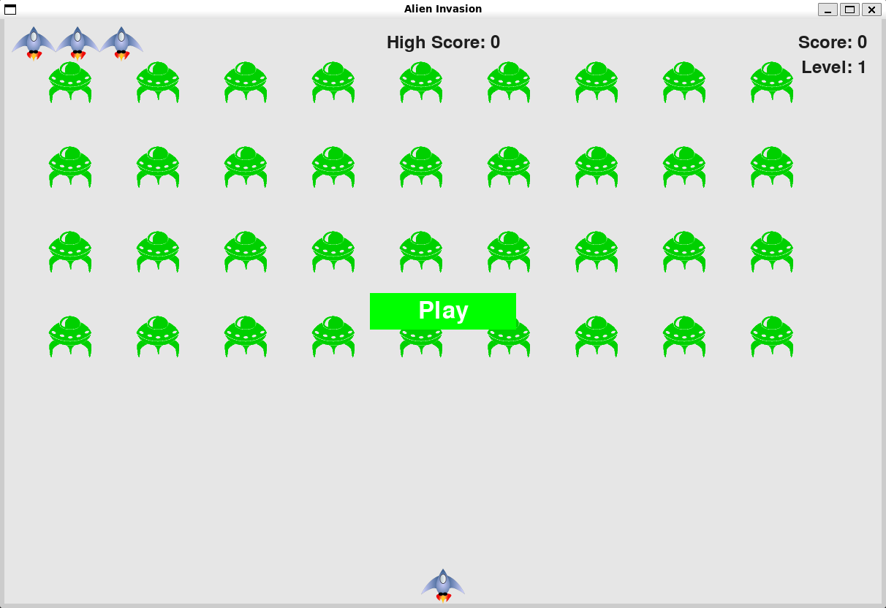
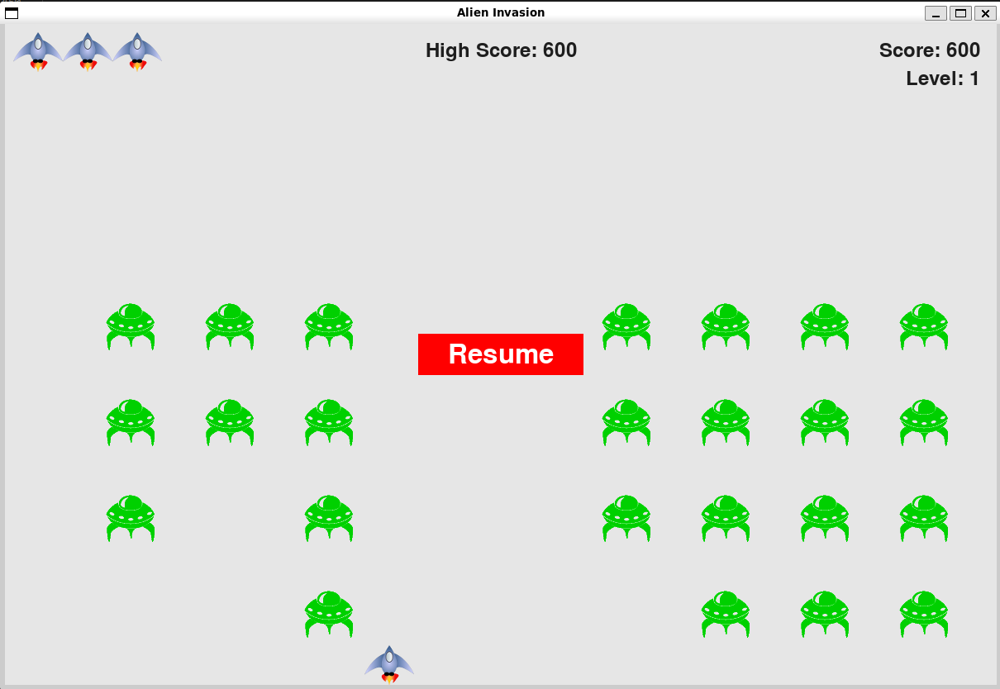
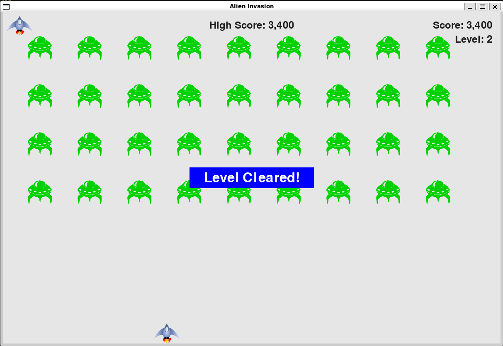
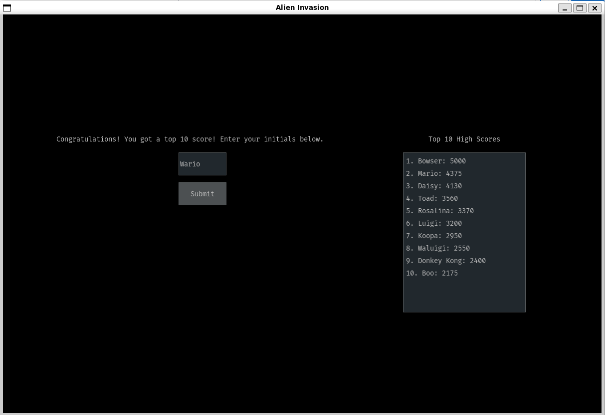

# Alien Invasion Game
This is a game implemented with the [Pygame](https://www.pygame.org/docs/) library. It is very similar to the classic "Space Invaders" arcade game.

To install all required packages to run the game from your command line or IDE, use this command:

`pip install -r requirements.txt`

## Starting The Game
Upon starting the game, you will see a green button that prompts you to start the game. You can either click on the button or press Enter to start the game.

You can move the ship side to side using the left and right arrow keys, and fire bullets using the spacebar. You can only have 3 bullets on screen at any time.

## Pausing the Game
You can pause the game by pressing the P key. After pressing this button, you will see a red button that prompts you to resume the game. You can either click on the button or press Enter to resume the game. There is a slight pause after you choose to resume the game to give you a chance to get reacclimated to gameplay.

## Advancing Levels
After clearing all of the ships in a level, the game will pause and there will be a blue button informing you that you have cleared the level. You can either click on the button or press Enter to resume the game. There is a slight pause after you choose to resume the game to give you a chance to get reacclimated to gameplay.

## High Scores
If you have attained a top 10 high score, you are prompted to save your score with a set of initials (or a name) to go onto the leaderboard. You can see the other players that have reached the top 10 on this same screen.

## To-Do List
- :white_check_mark: Pause button
- :white_check_mark: "Enter" key to Play (offered as alternative to clicking button)
- :white_check_mark: "Enter" key to Resume (offered as alternative to clicking button)
- :white_check_mark: Pause between levels
- :white_check_mark: "Level cleared!" message when level is cleared
- :white_check_mark: Prompt for 3 initials when game over (if top 10 high score)
- :white_check_mark: Save Top 10 High Scores to file to persistent storage
- :white_check_mark: All-Time High Score constantly displayed
- :white_check_mark: Headers for Level, Player Score, All-Time High Score
- :white_check_mark: Make the high score saving look better
- :white_check_mark: Actually show the top 10 scores in the score saving window
- Make an executable so that the game can just be downloaded w/o needing to run Python (PyInstaller)